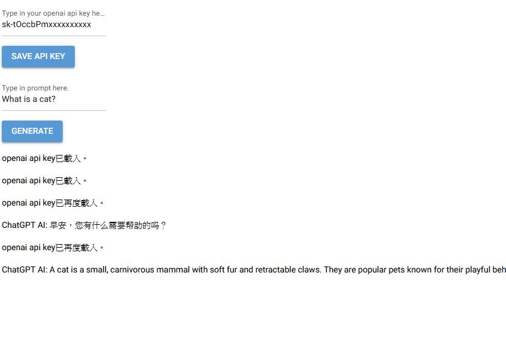
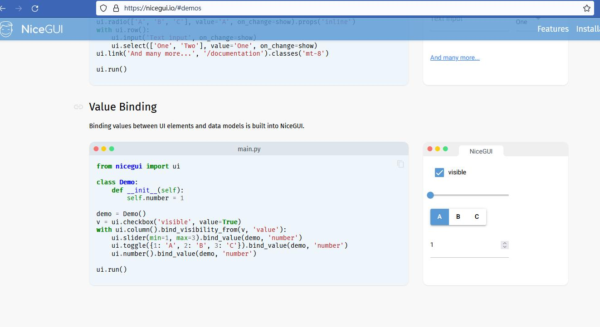
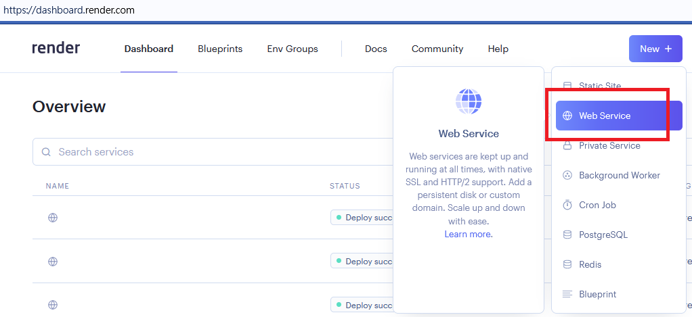
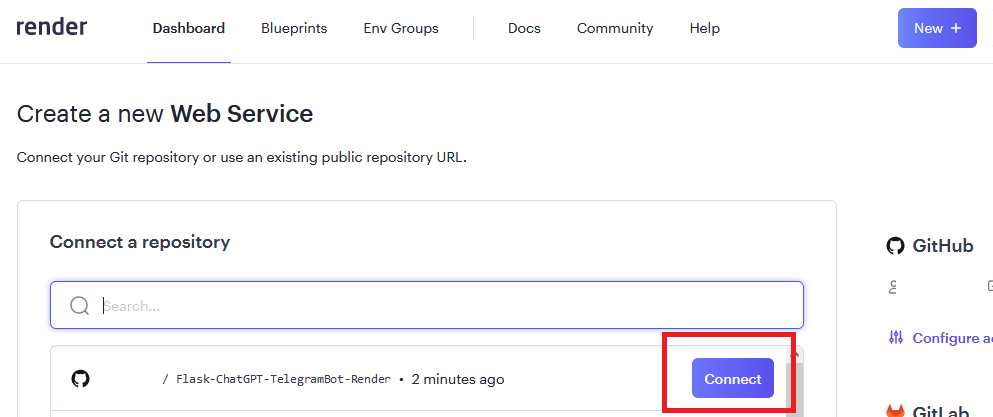
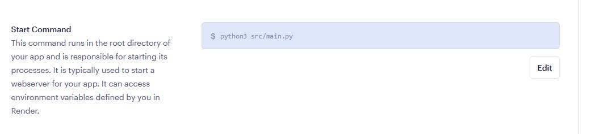

# NiceGUI-ChatGPT3.5-Render
# 一個使用NiceGUI框架和GPT3.5 turbo模型官方API，快速建置Web app於平台Render。

  

  

### [English](https://github.com/pyfbsdk59/NiceGUI-ChatGPT3.5-Render/blob/main/README_en.md)
### [日本語](https://github.com/pyfbsdk59/NiceGUI-ChatGPT3.5-Render/blob/main/README_jp.md)

### 1. 本專案參考了以下前輩和官方的方案改成製作，只針對剛學習Python或nicegui的朋友來佈置Web app在Render上。Render可取代取消免費方案的Heroku，來測試Side Project。

https://github.com/joeychrys/streamlit-chatGPT/  
https://nicegui.io/  

  

#### 2. 本專案部屬在Render平台上。Render網站中，選擇新增「Web Services」，可用github帳號匯入此專案，可先fork到自己的帳號，然後設定自己的名稱和選擇免費free方案。不需設定環境變數。

  

  

### 3. 注意Start Command要改為python3 src/main.py來啟動。（一個坑，可以省你很多時間）

  

